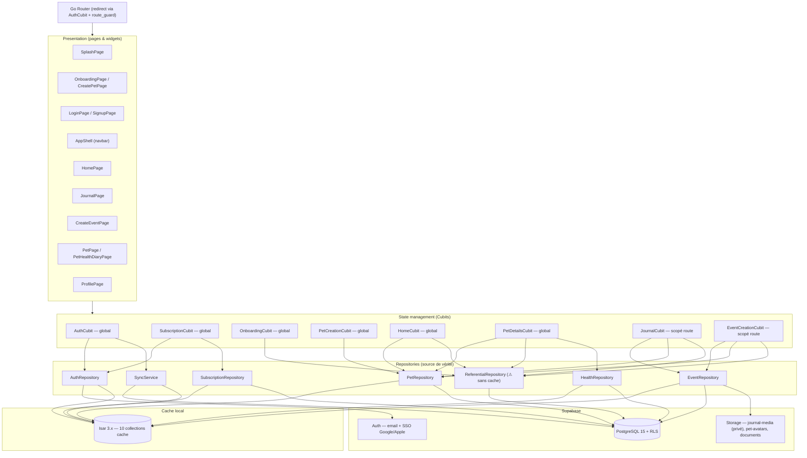
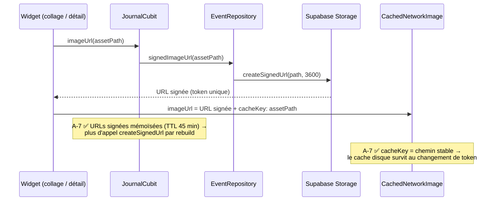

# Audit technique — Nanimo

> Audit réalisé le 2026-07-01 sur `main` (d5f235c). Périmètre : code Flutter (`lib/`, `test/`), CI/CD, conventions, cohérence avec `CLAUDE.md`.

> **Statut de remédiation** — Les 13 constats (A-1 → A-13) ont été traités sur la branche `claude/project-audit-architecture-nwbjt6` (un commit par point). Chaque constat ci-dessous porte désormais sa résolution ✅ et ce qu'il reste éventuellement à faire côté serveur/produit. Les schémas d'architecture (§2-5) sont conservés comme référence, avec leurs annotations mises à jour.

---

## 1. Vue d'ensemble

**Chiffres clés**

| Métrique | Valeur |
| --- | --- |
| Fichiers Dart (hors générés) | ~137 dans `lib/`, 64 fichiers de test |
| Lignes `lib/` (hors `.g.dart`) | ~10 900 |
| Couverture de tests | **81,8 %** (3090/3777 lignes) — seuil CI 80 % ✅ |
| Lint | `flutter_lints` par défaut, `analyze --fatal-infos` en CI |
| Plus gros fichier | `pet_details_cubit.dart` (378 lignes) |

**Points forts** (à préserver)

- Architecture feature-first propre et **très cohérente** : chaque feature suit le même schéma `data/ → presentation/cubit/ → presentation/page|widgets/`. Aucune page n'appelle Supabase directement.
- Pattern offline-first lisible : les lectures passent toutes par Isar (`watch*` streams), les écritures par Supabase puis mise à jour du cache. Le glossaire `CONTEXT.md` qui précise « offline = lectures seulement » est une excellente pratique.
- Bonne hygiène de tests (unitaires + widgets + flux), seuil de couverture appliqué en CI, hook `commit-msg` partagé local/CI via `scripts/commit-msg-lint.sh`.
- Stratégie « pending pet » (onboarding avant signup) bien isolée dans `PetCreationCubit`, avec retry.
- Helpers freemium **fail-closed** (`SubscriptionState.canCreatePet` renvoie `false` sans config).
- SSO natif (nonce SHA-256 pour Apple/Google) conforme aux recommandations Supabase.

---

## 2. Schéma — Architecture en couches



**Lecture** : les cubits ne parlent qu'aux repositories ; chaque repository écrit dans Supabase puis reflète dans Isar ; les streams Isar (`watch`) alimentent l'UI en retour. `ReferentialRepository` est désormais cache-first lui aussi (espèces + types en cache Isar, A-5 ✅). `HomeCubit`/`PetDetailsCubit` sont scopés au `ShellRoute` (A-8 ✅), plus au root.

---

## 3. Schéma — Démarrage, auth et synchronisation

```mermaid
sequenceDiagram
    participant App as main.dart
    participant Auth as AuthCubit
    participant Sync as SyncService
    participant SB as Supabase
    participant Isar as Isar (cache)
    participant Router as Go Router

    App->>App: dotenv.load(.env)
    App->>SB: Supabase.initialize()
    App->>Isar: IsarService.initialize()
    App->>Auth: création (écoute onAuthStateChange)

    SB-->>Auth: initialSession / signedIn
    Auth->>Sync: syncCritical() — attendu
    par Vague 1 (bloquante)
        Sync->>SB: SELECT users, pets, subscription_config
        Sync->>Isar: clear() + putAll par table
    end
    Auth->>Sync: syncSecondary() — fire & forget
    Note over Sync: Vague 2 : events, images, pets_events, health,<br/>vaccines, weight_logs, vet_visits, référentiel<br/>erreurs désormais loggées (A-4 ✅)
    Auth-->>Router: status = authenticated
    Router-->>Router: redirect → /home (ShellRoute crée Home/PetDetails)
    Isar-->>App: streams watch*() → UI réactive
    Note over App,Isar: resync() au resume + pull-to-refresh (A-6 ✅) ;<br/>purge du cache au sign-out (A-1 ✅)
```

**Résiduel** : la sync reste *full-table* (pas de delta). Les colonnes `updated_at` sont désormais versionnées (`supabase/migrations/0003…`, A-11) pour préparer le delta sync côté client, à implémenter en V2.

---

## 4. Schéma — Création d'un souvenir (event)

```mermaid
sequenceDiagram
    participant P as CreateEventPage
    participant C as EventCreationCubit
    participant ER as EventRepository
    participant SB as Supabase DB
    participant ST as Storage journal-media
    participant Isar as Isar

    P->>C: submit(titre, date, photos, petIds)
    Note over C: eventId stable (mémorisé pour le retry) ;<br/>photos plafonnées au quota du plan (A-2 ✅)
    loop pour chaque photo (upload AVANT les inserts)
        C->>ER: uploadEventImage(eventId, file)
        ER->>ST: upload userId/eventId/uuid.ext
        Note over C: chemin mémorisé → un retry ne ré-uploade pas
    end
    C->>ER: createEvent(event, petIds)
    ER->>SB: INSERT events + pets_events (ON CONFLICT DO NOTHING)
    C->>ER: addImage(EventImageModel) [idempotent]
    ER->>SB: INSERT event_image (ignore 23505)
    C-->>P: status = success

    Note over C,SB: A-3 ✅ Idempotent : un retry réutilise le même eventId,<br/>ne ré-uploade pas, et les inserts ignorent les doublons.<br/>Fichiers uploadés avant l'event → pas d'event orphelin.
    Note over C,SB: RPC transactionnelle create_event fournie<br/>dans supabase/migrations/0005 (à câbler côté client).
```

## 5. Schéma — Affichage des photos du journal



---


## 6. Registre de résolution des constats

Chaque constat de l'audit initial est traité sur la branche. Ordre par criticité d'origine.

### 🔴 Critiques

**A-1 · Cache Isar non purgé à la déconnexion — ✅ Résolu**
`SyncService.clearAllCaches()` vide toutes les collections dans une transaction ; `AuthCubit` l'appelle dès que la session devient nulle (sign-out ou expiration), avant d'émettre `unauthenticated`. Plus de fuite de données inter-comptes sur appareil partagé. Tests : `sync_service_test.dart`, `auth_cubit_test.dart`.

**A-2 · Quotas freemium non appliqués — ✅ Résolu (client) + serveur fourni**
`SubscriptionState` expose `maxImagesPerEvent`/`maxPets` (fail-closed à 0). `CreateEventPage` plafonne les photos au quota du plan (free = 1, premium = 5) avec message d'upsell. Un bug révélé au passage (`pickMultiImage(limit: 1)` interdit) est corrigé. Côté serveur, `supabase/migrations/0004_freemium_quota_triggers.sql` applique `max_pets` et `max_images_per_event` en base (non contournable). Tests : `create_event_page_test.dart` (free garde 1/3, premium 3/3), `subscription_state_test.dart`.
_Résiduel :_ pas de flux d'ajout d'un 2ᵉ animal post-auth aujourd'hui ; `canCreatePet` s'appliquera quand ce flux existera (le trigger serveur protège déjà).

**A-3 · Création d'événement non atomique + doublons au retry — ✅ Résolu**
`EventCreationCubit` mémorise l'`eventId` entre les tentatives, uploade les photos **avant** les inserts (fichier orphelin bénin, jamais d'event orphelin), et mémorise les chemins uploadés (un retry ne ré-uploade pas). `EventRepository` ignore le code `23505` sur `events`/`pets_events`/`event_image`. RPC transactionnelle `create_event` versionnée (`0005…`) à câbler côté client. Test : `event_creation_cubit_test.dart` (retry = même id, 1 seul upload).

### 🟠 Élevés

**A-4 · Erreurs avalées / maquillées — ✅ Résolu**
`core/errors/repository_exception.dart` : `mapRepositoryError` distingue `PostgrestException`/`StorageException` (→ `RepositoryServerException`) d'une vraie coupure réseau (→ `RepositoryNetworkException`), et logge chaque échec via `dart:developer`. Tous les repositories l'utilisent ; les 10 `catch` de `SyncService` loggent au lieu d'avaler. Tests : `repository_exception_test.dart` + chemins d'erreur de chaque repository.
_Résiduel :_ intégration Sentry/Crashlytics et bandeau « données non à jour » (V2).

**A-5 · Référentiel non caché → écrans cassés hors-ligne — ✅ Résolu**
Nouvelles collections `PetSpeciesCache`/`EventTypeCache` ; `ReferentialRepository` est cache-first (fetch réseau → write-through, sinon fallback cache), synchronisé dans la vague 2 de `SyncService`. `HomeCubit._loadSpecies` a désormais son try/catch. Tests : `referential_repository_test.dart` (offline sert le cache).

**A-6 · Sync full-table, uniquement au login — ✅ Résolu (déclencheurs) / delta en V2**
`AuthCubit.resync()` relance les deux vagues sur `AppLifecycleState.resumed` (observer dans `AppShell`) et sur pull-to-refresh du journal. Les colonnes `updated_at` + triggers `moddatetime` sont versionnées (`0003…`) pour le delta sync, à implémenter côté client en V2. Tests : `auth_cubit_test.dart`, `journal_timeline_widget_test.dart`.

**A-7 · Cache d'images inopérant — ✅ Résolu**
`cacheKey: assetPath` sur les deux `CachedNetworkImage` (clé de cache stable malgré le token) ; `JournalCubit.imageUrl` mémoïse les URLs signées (TTL 45 min). Test : `journal_cubit_test.dart` (1 seul `signedImageUrl` par asset).

### 🟡 Moyens / 🟢 Faibles

**A-8 · Cubits globaux, fuite `_AuthCubitListenable` — ✅ Résolu**
`HomeCubit`/`PetDetailsCubit` scopés au `ShellRoute` (créés au login, fermés au logout — plus de données rémanentes ni d'abonnements Isar sur les écrans d'auth). `_AuthCubitListenable` annule sa `StreamSubscription` dans `dispose()`.

**A-9 · Filtre `titleIsNotEmpty()` = « pas de filtre » — ✅ Résolu**
`watchEvents` utilise `where().sortByEntryDateDesc()`. Un event au titre vide n'est plus masqué. Test de non-régression ajouté.

**A-10 · Dérive CLAUDE.md ↔ code — ✅ Résolu**
Stack (FCM → V2), arbre des features (journal/event/subscription présents, `settings/` absent), `health_diary_weight_log`, versions `flutter_bloc`/`go_router`/`supabase_flutter`, pointeur vers `supabase/migrations/` corrigés.

**A-11 · Schéma SQL / RLS non versionnés — ✅ Résolu**
`supabase/migrations/` : schéma initial, RLS (accès via `users_pets`), `updated_at`, triggers de quotas, RPC `create_event`, + `supabase/README.md`.
_Résiduel :_ réconciliation `supabase db diff` avec la base live et tests RLS (pgTAP) à faire au déploiement.

**A-12 · `.env` sans exemple, README boilerplate — ✅ Résolu**
`.env.example` documenté (valeurs publiques uniquement) + README racine réécrit (setup, `.env`, hooks, build_runner, tests, pointeur DB).

**A-13 · Dettes diverses — ✅ Partiellement traité**
_Résiduel (tickets dédiés) :_ cohérence UTC dans `getUpcomingVaccinesForPet`, i18n des messages remontés en présentation, scission de `pet_details_cubit.dart`, lints additionnels, `AuthCubit._formatError` via `AuthException.code`.

---

## 7. Ce qui reste pour la V2

Les points ci-dessous sont volontairement hors périmètre de cette passe (produit ou infra lourde) et documentés comme suite :

1. **Delta sync client** sur `updated_at` (les colonnes existent) + Supabase Realtime pour le multi-device.
2. **Câbler la RPC `create_event`** dans `EventRepository` une fois déployée, et écrire les tests RLS.
3. **Crash reporting** (Sentry) + bandeau d'état de sync.
4. **Suppression de compte / export RGPD**, paywall d'achat premium, notifications FCM, édition de souvenir, calendrier, export PDF — cf. roadmap V2.
5. **Dettes A-13 résiduelles** (UTC, i18n, split cubit, lints) au fil de l'eau.
