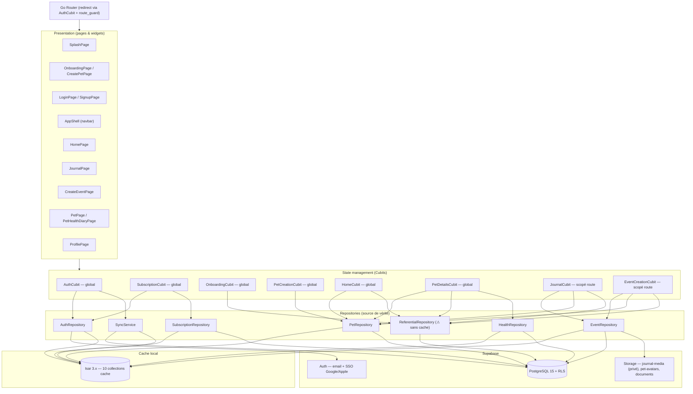
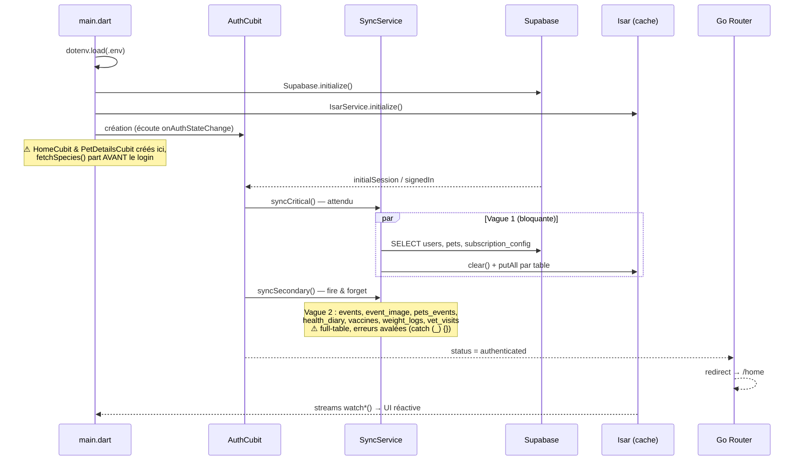
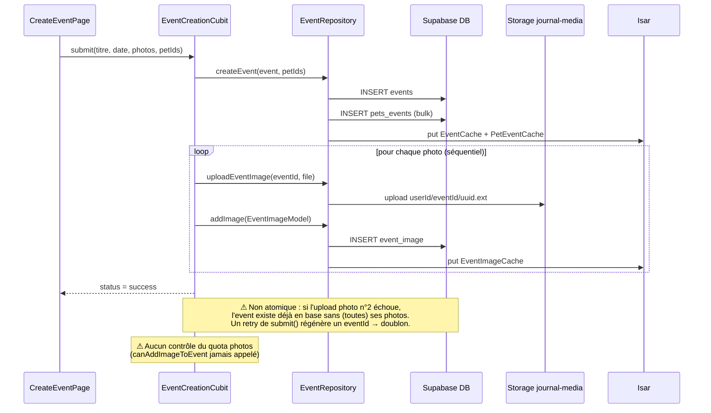
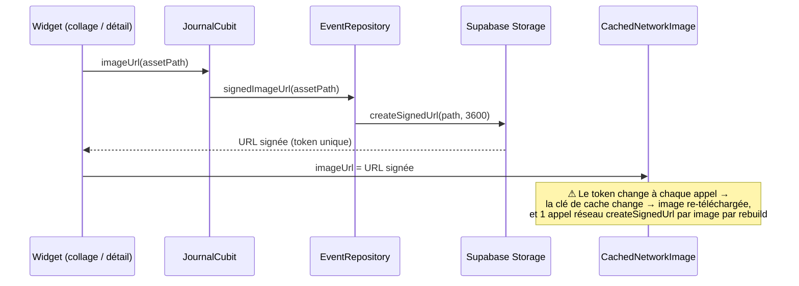

# Audit technique — Nanimo

> Audit réalisé le 2026-07-01 sur `main` (d5f235c). Périmètre : code Flutter (`lib/`, `test/`), CI/CD, conventions, cohérence avec `CLAUDE.md`. Le backend Supabase (schéma SQL, policies RLS, triggers) n'est pas versionné dans ce repo et n'a donc pas pu être audité directement — c'est en soi un constat (voir A-11).

---

## 1. Vue d'ensemble

**Chiffres clés**

| Métrique | Valeur |
| --- | --- |
| Fichiers Dart (hors générés) | ~137 dans `lib/`, 64 fichiers de test |
| Lignes `lib/` (hors `.g.dart`) | ~10 900 |
| Couverture de tests | **81,8 %** (3090/3777 lignes) — seuil CI 80 % ✅ |
| Lint | `flutter_lints` par défaut, `analyze --fatal-infos` en CI |
| Plus gros fichier | `pet_details_cubit.dart` (378 lignes) |

**Points forts** (à préserver)

- Architecture feature-first propre et **très cohérente** : chaque feature suit le même schéma `data/ → presentation/cubit/ → presentation/page|widgets/`. Aucune page n'appelle Supabase directement.
- Pattern offline-first lisible : les lectures passent toutes par Isar (`watch*` streams), les écritures par Supabase puis mise à jour du cache. Le glossaire `CONTEXT.md` qui précise « offline = lectures seulement » est une excellente pratique.
- Bonne hygiène de tests (unitaires + widgets + flux), seuil de couverture appliqué en CI, hook `commit-msg` partagé local/CI via `scripts/commit-msg-lint.sh`.
- Stratégie « pending pet » (onboarding avant signup) bien isolée dans `PetCreationCubit`, avec retry.
- Helpers freemium **fail-closed** (`SubscriptionState.canCreatePet` renvoie `false` sans config).
- SSO natif (nonce SHA-256 pour Apple/Google) conforme aux recommandations Supabase.

---

## 2. Schéma — Architecture en couches

**Lecture** : les cubits ne parlent qu'aux repositories ; chaque repository écrit dans Supabase puis reflète dans Isar ; les streams Isar (`watch`) alimentent l'UI en retour. `ReferentialRepository` est la seule exception au pattern : il tape Supabase en direct, sans cache (voir A-5).

---

## 3. Schéma — Démarrage, auth et synchronisation

**Constats sur ce flux** : la sync est *full-table* (pas de delta, pas de pagination), déclenchée uniquement à `signedIn`/`initialSession` (jamais pendant la session → multi-device périmé jusqu'au redémarrage), et toutes ses erreurs sont silencieuses.

---

## 4. Schéma — Création d'un souvenir (event)

## 5. Schéma — Affichage des photos du journal

---

## 6. Constats détaillés

### A-1 · Le cache Isar n'est jamais purgé à la déconnexion — 🔴 Critique

`AuthRepository.logout()` (`lib/features/auth/data/auth_repository.dart:134`) appelle uniquement `supabase.auth.signOut()`. Aucune collection Isar n'est vidée, ni au logout ni au changement d'utilisateur.

**Conséquences** : sur un appareil partagé, l'utilisateur B qui se connecte voit les animaux, souvenirs et données de **santé** de l'utilisateur A tant que `syncCritical`/`syncSecondary` n'ont pas fini de remplacer le cache — et indéfiniment s'il se connecte hors-ligne (la sync échoue silencieusement et les streams Isar servent les données de A). Les données restent aussi en clair sur le disque après déconnexion. Pour une app qui stocke des données de santé et des souvenirs personnels, c'est une fuite de données inter-comptes.

**Traitement** : dans `AuthCubit` sur l'événement `signedOut` (ou dans `logout()`), exécuter `isar.writeTxn(() => isar.clear())` (ou vider les 10 collections). Stocker aussi le `userId` propriétaire du cache et le comparer au login : si différent → purge avant sync.

### A-2 · Les quotas freemium ne sont appliqués nulle part — 🔴 Critique

Les helpers `canCreatePet`, `canAddImageToEvent`, `canAccessPremiumIcons`, `canUseStorage` (`lib/features/subscription/presentation/cubit/subscription_state.dart:26-38`) ne sont **consommés par aucun widget ni cubit** (grep : seules leurs définitions et leurs tests existent). `EventCreationCubit.submit` accepte n'importe quel nombre de photos, `PetCreationCubit`/`PetRepository.createPet` ne comptent pas les animaux existants. Rien dans le repo n'indique une application côté serveur (pas de migrations versionnées, cf. A-11).

**Conséquences** : le modèle économique n'est pas appliqué — un compte free peut créer 10 animaux et 5 photos par souvenir. Toute l'infrastructure `SubscriptionCubit`/config/cache tourne pour rien.

**Traitement** :
1. Court terme (client) : brancher `context.read<SubscriptionCubit>().state.canAddImageToEvent(...)` dans `AddImageBottomSheetWidget`/`EventCreationCubit.submit`, et `canCreatePet(pets.length)` dans le flux d'ajout d'animal ; griser l'UI + upsell.
2. Indispensable (serveur) : le client est contournable — appliquer les quotas en base via triggers/policies RLS (`count(pets) < max_pets` du plan) ou une RPC `create_event_with_images`. Sans ça, le premium n'a aucune valeur défendable.

### A-3 · Création d'événement non atomique + doublons au retry — 🔴 Critique

`EventCreationCubit.submit` (`lib/features/event/presentation/cubit/event_creation_cubit.dart:106-130`) enchaîne 4 écritures distantes non transactionnelles : `INSERT events` → `INSERT pets_events` → upload Storage → `INSERT event_image`, en séquence. `EventRepository.createEvent` a le même problème en interne (2 inserts).

**Scénario d'échec concret** : le réseau tombe pendant l'upload de la photo → l'event est déjà en base, l'état passe à `error`, l'utilisateur re-soumet → nouveau `Uuid().v4()` → **souvenir en double**, le premier sans photo. Variante : `events` réussit, `pets_events` échoue → event orphelin invisible dans le journal (et non supprimable par l'utilisateur).

**Traitement** : déplacer la transaction côté Postgres via une fonction RPC (`create_event(event, pet_ids)` en un appel), uploader les photos **avant** de créer l'event (un fichier orphelin dans Storage est bénin, un event orphelin ne l'est pas), et conserver l'`eventId` dans le state pour que le retry soit idempotent (les `insert` peuvent alors ignorer le code `23505` comme le fait déjà `PetRepository._insertIgnoringDuplicate`).

### A-4 · Erreurs systématiquement avalées ou maquillées — 🟠 Élevé

Deux patterns problématiques, présents partout :

- `SyncService` : les 9 méthodes `_sync*` se terminent par `catch (_) {}` (`lib/core/isar/database/sync_service.dart`). Une erreur RLS, un JSON malformé, une régression de schéma → aucune trace, l'app affiche simplement des données périmées ou vides.
- Tous les repositories transforment **toute** exception en `RepositoryNetworkException('Une connexion internet est requise…')` (`event_repository.dart:46`, `pet_repository.dart:91`, `health_repository.dart:38`, etc.). Une violation de contrainte, un refus RLS ou un bug de sérialisation s'affiche « vérifiez votre connexion » — indiagnosticable en production, d'autant qu'il n'y a **aucun crash reporting** (pas de Sentry/Crashlytics dans `pubspec.yaml`).

**Traitement** :
1. Différencier au minimum `PostgrestException`/`StorageException` (erreur serveur/permission) de `SocketException`/`TimeoutException` (vraie erreur réseau) dans un mapper commun (ex. `RepositoryException.fromError(e)`).
2. Ajouter un logger central (même un simple `dart:developer log`) dans chaque `catch`, puis intégrer Sentry ou Crashlytics avant toute mise en production.
3. Faire remonter l'état de la sync (enum `SyncStatus` exposé par `SyncService`) pour afficher un bandeau « données non à jour ».

### A-5 · Le référentiel n'est pas caché → écrans cassés hors-ligne — 🟠 Élevé

`ReferentialRepository` (`lib/data/repositories/referential_repository.dart`) interroge Supabase à chaque appel, sans cache Isar. Or `JournalCubit._load`, `EventCreationCubit.load`, `HomeCubit._loadSpecies` et `PetDetailsCubit._loadSpecies` en dépendent.

**Conséquences** : hors-ligne, le journal affiche « Impossible de charger le journal » **alors que tous les événements sont dans le cache** — la promesse offline-first (lectures disponibles hors-ligne, cf. `CONTEXT.md`) est rompue par des données quasi statiques (espèces, races, types d'événement). Bonus : `HomeCubit._loadSpecies` (`home_cubit.dart:33-40`) n'a **pas de try/catch** contrairement à `PetDetailsCubit` ; hors-ligne, la future échoue en erreur asynchrone non interceptée dès le boot (le cubit est créé dans `main()` avant même le login — appel réseau avant auth).

**Traitement** : ajouter des collections cache `PetSpeciesCache`/`PetRaceCache`/`EventTypeCache` synchronisées dans la vague 2 du `SyncService`, faire lire le référentiel depuis Isar avec refresh réseau opportuniste ; ajouter le try/catch manquant dans `HomeCubit` ; instancier `HomeCubit`/`PetDetailsCubit` après authentification (scopés au `ShellRoute`, comme `JournalCubit`).

### A-6 · Sync full-table, uniquement au login — 🟠 Élevé

`SyncService` re-télécharge **l'intégralité** de chaque table (`select()` sans filtre ni pagination) et fait `clear()` + `putAll` à chaque `signedIn`/`initialSession`. Aucun re-sync pendant la session : un souvenir créé sur un autre appareil n'apparaît qu'au prochain redémarrage de l'app.

**Conséquences** : coût réseau/latence croissant linéairement avec l'historique (des années de souvenirs + images + logs de poids), quota Supabase consommé inutilement, expérience multi-device incohérente.

**Traitement** :
1. Ajouter `updated_at` (trigger `moddatetime`) sur les tables et ne récupérer que `updated_at > lastSyncedAt` (delta sync), avec tombstones ou soft-delete pour propager les suppressions (le commit e51a85e a choisi `clear()` justement pour ça — le delta sync est la vraie solution).
2. Re-synchroniser sur `AppLifecycleState.resumed` + pull-to-refresh sur Journal/Home.
3. À terme, Supabase Realtime sur `events`/`pets` pour le multi-device.

### A-7 · URLs signées + `CachedNetworkImage` : cache d'images inopérant — 🟠 Élevé

`EventRepository.signedImageUrl` génère une URL signée à chaque affichage (`event_repository.dart:108-113`) et les widgets la passent telle quelle à `CachedNetworkImage` (`event_polaroid_collage_widget.dart:159`, `journal_event_detail_bottom_sheet_widget.dart:267`). Le token signé change à chaque appel → la clé de cache change → chaque rebuild re-télécharge les images **et** fait un aller-retour `createSignedUrl` par image.

**Traitement** : passer `cacheKey: assetPath` à `CachedNetworkImage` (le cache disque devient stable malgré l'URL changeante), mémoïser les URLs signées dans le cubit avec un TTL < 3600 s, et utiliser `createSignedUrls` (batch) pour une liste d'événements.

### A-8 · Cubits globaux : cycle de vie et fuites — 🟡 Moyen

- `HomeCubit`, `PetDetailsCubit`, `OnboardingCubit`, `PetCreationCubit` sont créés dans `main()` et vivent (avec leurs subscriptions Isar) toute la durée de l'app, même sur les écrans d'auth. Seuls `AuthCubit` et `SubscriptionCubit` ont une vraie raison d'être globaux.
- `_AuthCubitListenable` (`app_router.dart:28-32`) `listen()` sans jamais `cancel()` ni `dispose()`.
- Après un logout, les states de `HomeCubit`/`PetDetailsCubit` conservent les données du user précédent (même problème que A-1, côté mémoire).

**Traitement** : scoper `HomeCubit`/`PetDetailsCubit` au `ShellRoute` (créés au login, fermés au logout), `OnboardingCubit`/`PetCreationCubit` aux routes d'onboarding ; stocker la `StreamSubscription` dans `_AuthCubitListenable` et l'annuler dans `dispose()`.

### A-9 · Filtre `titleIsNotEmpty()` = « pas de filtre » — 🟡 Moyen

`EventRepository.watchEvents` (`event_repository.dart:19-28`) utilise `filter().titleIsNotEmpty()` comme requête neutre quand `eventTypeId == null`. Tout événement au titre vide (import, bug amont, évolution future « souvenir sans titre ») disparaît silencieusement du journal.

**Traitement** : `_isar.eventCaches.where().sortByEntryDateDesc()` — `where()` sans index est la requête « tout » idiomatique d'Isar, comme déjà fait dans `watchPetEvents`.

### A-10 · Dérive entre CLAUDE.md et le code — 🟡 Moyen

Le doc de référence promet des choses absentes du code (et inversement) :

| CLAUDE.md | Réalité |
| --- | --- |
| « Firebase FCM » (stack, notifications) | Aucune dépendance Firebase dans `pubspec.yaml`, table `notifications` inutilisée côté app |
| Feature `settings/` dans l'arbre | N'existe pas ; `ProfilePage` orpheline (« accès à recâbler ») |
| Table `weight_logs` | Le code interroge `health_diary_weight_log` |
| Export PDF premium, calendrier | Non implémentés (calendrier désactivé — assumé v2) |
| `flutter_bloc ^8.1.6` (§ Pattern) puis `^9.1.0` (§ deps) | `^9.1.1` réel |

**Traitement** : passe de mise à jour de CLAUDE.md (c'est le contexte donné aux outils IA et aux futurs contributeurs — une doc fausse coûte cher), trancher le sort de `ProfilePage`, et créer les tickets NAN pour FCM/settings/PDF plutôt que de les laisser en « stack » aspirationnelle.

### A-11 · Schéma SQL, RLS et triggers non versionnés — 🟡 Moyen

Toute la sécurité du modèle repose sur les policies RLS (`events` protégés via `pets_events → users_pets`, quotas, trigger `auth.users → public.users`), mais **rien de tout cela n'est dans le repo**. Impossible de reviewer la sécurité, de reproduire l'environnement, ou de faire évoluer le schéma de façon traçable ; un `supabase db reset` accidentel n'est pas récupérable depuis Git.

**Traitement** : adopter le CLI Supabase (`supabase init`, `supabase db diff`) et versionner `supabase/migrations/` + seed du référentiel. Ajouter ensuite des tests RLS (pgTAP ou tests d'intégration sur une instance locale) — c'est le seul moyen de vérifier A-2/A-3 côté serveur.

### A-12 · Onboarding : `.env` requis mais aucun `.env.example` — 🟡 Moyen

`pubspec.yaml` déclare `.env` comme asset et `main.dart` exige 5 clés ; `.env` est gitignoré (correct) mais aucun `.env.example` n'existe et le README est le boilerplate Flutter. Un clone frais ne build pas (`flutter run` échoue sur l'asset manquant), et la CI doit créer un `.env` vide à la main (`touch .env` dans `setup-flutter/action.yml`). À noter : embarquer `.env` dans les assets ship ces valeurs en clair dans l'APK/IPA — acceptable pour l'anon key et les client IDs (publics par design), mais à garder en tête avant d'y mettre autre chose ; `--dart-define-from-file` est l'alternative propre.

**Traitement** : committer un `.env.example` documenté, remplacer le README boilerplate par les instructions réelles (setup, `.env`, hooks, build_runner — le contenu de CLAUDE.md §8), et interdire par convention tout secret non-public dans `.env`.

### A-13 · Divers code — 🟢 Faible

- `getUpcomingVaccinesForPet` compare `nextDate` à `DateTime.now()` local alors que les dates viennent de la base — cohérence UTC/local à fixer (`weight/vaccine` : idem `PetCreationCubit` qui mixe `DateTime.now().toUtc()` et `DateTime.now()`).
- Messages d'erreur UX en français codés en dur dans la couche **data** (tous les repositories) : centraliser dans la présentation (et préparer l'i18n même si V1 = FR).
- `pet_details_cubit.dart` (378 lignes, 5 subscriptions) cumule détails pet + poids + vaccins + visites + carnet : à scinder (ex. `HealthDiaryCubit`).
- Lints par défaut uniquement : activer quelques règles rentables (`always_use_package_imports`, `unawaited_futures`, `prefer_final_locals`, `avoid_dynamic_calls`).
- CI : `release.yml` utilise `checkout@v4` vs `v5` ailleurs ; pas de job de build APK/AAB (une release tag ne produit aucun binaire) ; pas de Dependabot/renovate pour les actions et pubspec.
- `AuthCubit._formatError` matche les messages Supabase par chaîne exacte en anglais — fragile aux évolutions d'API ; préférer `AuthException.code` quand disponible.

---

## 7. Plan d'action priorisé

| # | Priorité | Sujet | Effort estimé | Ticket suggéré |
| --- | --- | --- | --- | --- |
| A-1 | 🔴 Critique | Purger Isar au logout / changement de compte | XS (½ j) | `fix(auth)` |
| A-2 | 🔴 Critique | Appliquer les quotas freemium (client **et** serveur) | M (2-4 j) | `feat(subscription)` |
| A-3 | 🔴 Critique | Création d'événement atomique + retry idempotent (RPC) | M (2-3 j) | `fix(event)` |
| A-4 | 🟠 Élevé | Typage des erreurs + logging + crash reporting | S (1-2 j) | `refactor(core-errors)` |
| A-5 | 🟠 Élevé | Cache Isar du référentiel + try/catch `HomeCubit` | S (1-2 j) | `feat(referential)` |
| A-6 | 🟠 Élevé | Delta sync (`updated_at`) + re-sync au resume | M (3-5 j) | `feat(sync)` |
| A-7 | 🟠 Élevé | `cacheKey` images + mémoïsation des URLs signées | XS (½ j) | `perf(journal)` |
| A-8 | 🟡 Moyen | Scoper les cubits, fuite `_AuthCubitListenable` | S (1 j) | `refactor(app)` |
| A-11 | 🟡 Moyen | Versionner migrations SQL + RLS (CLI Supabase) | S (1-2 j) | `chore(db)` |
| A-9 | 🟡 Moyen | Requête « tous les events » sans `titleIsNotEmpty` | XS (<1 h) | `fix(event)` |
| A-10 | 🟡 Moyen | Resynchroniser CLAUDE.md avec le code | XS (½ j) | `docs(claude-md)` |
| A-12 | 🟡 Moyen | `.env.example` + vrai README | XS (½ j) | `docs(readme)` |
| A-13 | 🟢 Faible | UTC, i18n des messages, split PetDetailsCubit, lints, CI build | S-M (au fil de l'eau) | divers |

**Ordre recommandé** : A-1 et A-7 immédiatement (une demi-journée à deux, gain maximal), puis A-4 + A-5 (ils conditionnent le diagnostic de tout le reste), A-11 (prérequis pour faire A-2 et A-3 proprement côté serveur), puis A-2, A-3, A-6.
